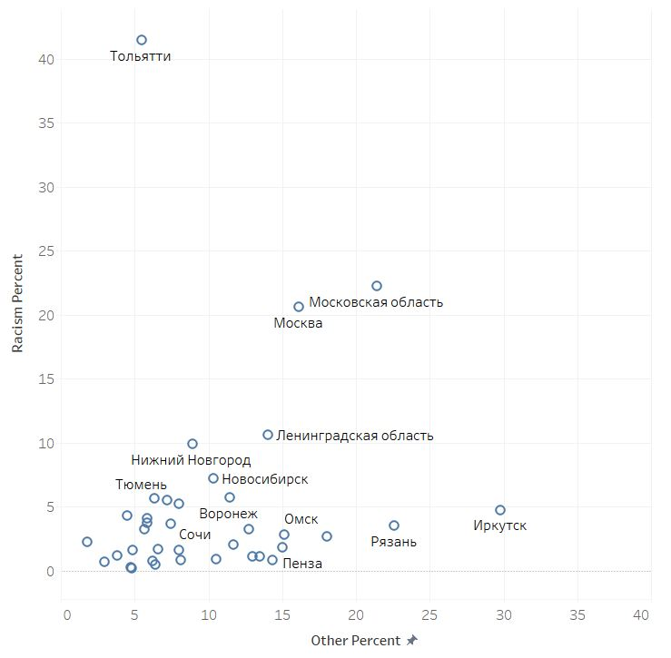
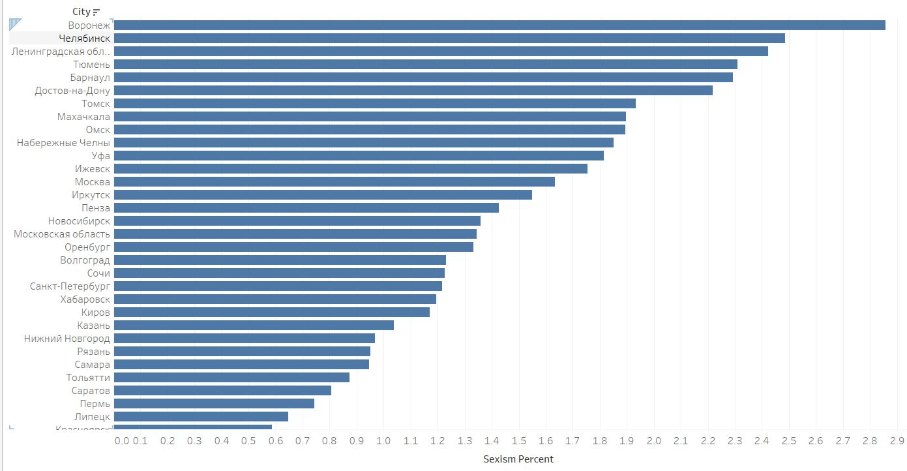

# Дискриминация арендаторов в онлайн пространстве

## Цель  
"Только славянам", "не мужчинам". Такие формулировки часто можно встретить на сайтах, которые размешают объявления об аренде квартир. Много ли людей или агентств дискриминируют арендаторов по национальному, гендерному признаку, по этнической принадлежности или семейному положению? Мы решили выяснить это на примере агрегатора объявлений CIAN и посмотреть, в каких городах России больше всего объявлений с дискриминационными признаками. 

## Источники данных  

Источником данных послужил агрегатор объявлений CIAN. В ходе исследования были проанализированы объявления за 2018 год. Тексты объявлений скачаны при помощи инстурмента Selenium.   

Полученные данные не содержат персональной информации об арендодателях и не будут использоваться в коммерческих целях. Законом использование полученных данных не ограничивается.

## Лицензия на использование данных
Creative Common   
автор: alsu8rinatovna@gmail.com   
facebook: https://www.facebook.com/alsu.zaynutdinova

## Инструменты, форматы данных  
Первоначальные данные включали в себя текст опубликованных объявлений по аренде жилья для каждого выбранного города. Города выбирались по численности населения свыше 500 тысяч. Далее были выявлены ключевые слова, которые характеризовали объявления 
дискриминирующим, например, "славянин", "женщина", "средняя азия", "гражданин РФ", "семья". Таким образом мы определили несколько катерогий дискриминации - по этнической принадлежности, гендерному признаку, семейному положению, по гражданству.

Объявления были лемматизированы и для каждого города были определены средние значения по каждой катерогии. Набор данных состоит из файлов с коэффицентом дискриминации по всем городам. 
Данные предоставлены в формате json.

## Результаты

У нас получилось 7 файлов с разными показателями. В целом, лидирующие места по всем параметрам занимают Москва и Московская область.
Другие города могут входить в топ 10 по одной категории, но быть "отстающими" по другим.  
Больше всего поразил Тольятти - почти 40% объявлений упоминали этническое происхождение арендатора, и только в 6% написаны описательные слова, такие как "порядочный" или "плетёжеспособный". Это в 2 раза больше чем в Москве и в Московской области. В Санкт-Петербурге и в Ленинградской области арендаторы больше всех хотят граждан РФ - около 10%. 

Во всех городах больше предпочитают сдавать женщинам, или "девушкам-студенткам".Но этот процент невысок, в Воронеже, лидирующим в этой категории, таких объявлений около 3%.

### Выводы

Складывается впечатление, что многие объявления написаны агентами недвижимости, которые задают общий тренд описания арендатора в однои городе. Для проверки этой гипотезы нужны новые данные, в которых объявления будут размечаны кем они были написаны. 

 

 

